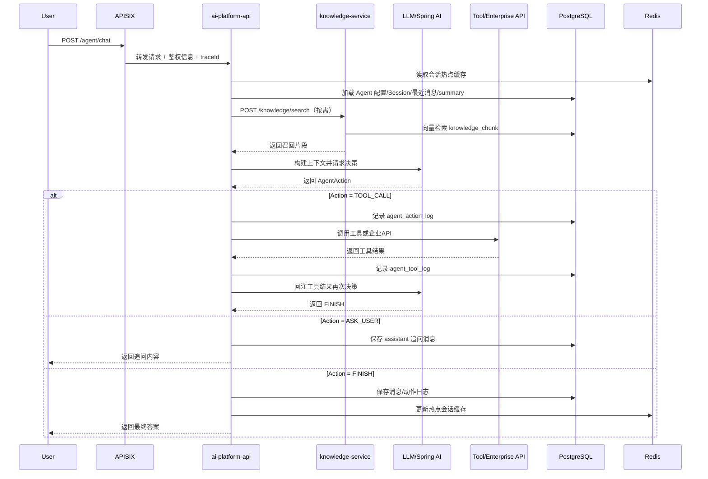
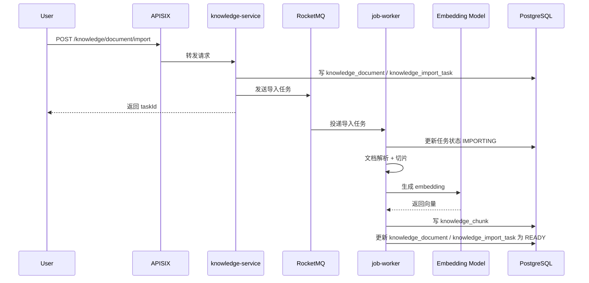
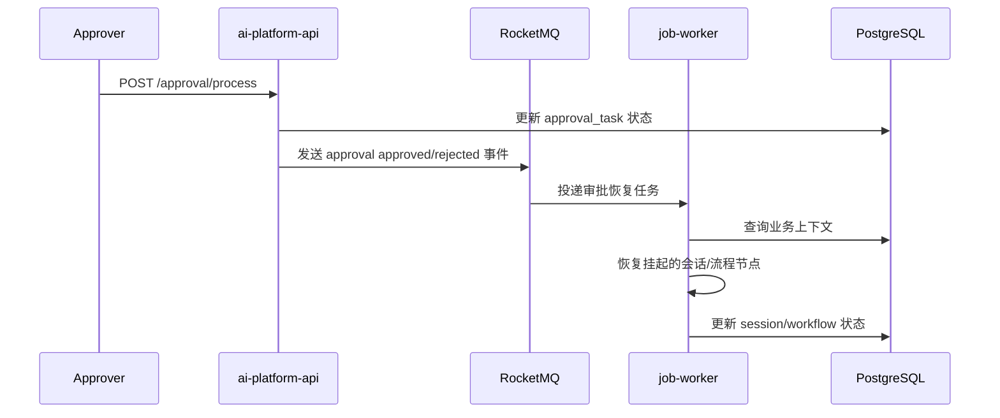

下面这版按你现在确定的微服务边界来出：`ai-platform-api + knowledge-service + job-worker`，并且遵循你现有接口习惯，**一期接口统一先用 `POST`**，便于后续规范一致。

**一、表设计初稿**

建议一期先共用一个 `PostgreSQL` 实例，按服务逻辑分表；向量列直接走 `pgvector`。  
如果后面你要严格按服务隔离，可以再拆 schema，比如 `platform`、`knowledge`、`job`。

---

**1. ai-platform-api 侧**

**`agent_config`**
用途：Agent 定义与运行配置。

核心字段：
- `id`
- `agent_code` `varchar(64)` 唯一
- `agent_name` `varchar(128)`
- `agent_type` `varchar(32)`
- `system_prompt` `text`
- `model_code` `varchar(64)`
- `temperature` `numeric(4,2)`
- `max_steps` `int`
- `tool_scope_json` `jsonb`
- `knowledge_scope_json` `jsonb`
- `approval_policy_json` `jsonb`
- `status` `varchar(32)`
- `ext_json` `jsonb`
- `created_at`
- `updated_at`

**`agent_session`**
用途：会话主表。

核心字段：
- `id`
- `session_id` `varchar(64)` 唯一
- `tenant_id` `varchar(64)`
- `user_id` `varchar(64)`
- `agent_code` `varchar(64)`
- `session_name` `varchar(255)`
- `status` `varchar(32)`
- `summary` `text`
- `last_message_at` `timestamp`
- `ext_json` `jsonb`
- `created_at`
- `updated_at`

索引建议：
- `uk_agent_session_session_id`
- `idx_agent_session_user_id`
- `idx_agent_session_agent_code`
- `idx_agent_session_last_message_at`

**`agent_message`**
用途：会话消息。

核心字段：
- `id`
- `session_id` `varchar(64)`
- `message_role` `varchar(32)`
- `message_type` `varchar(32)`
- `content` `text`
- `tool_name` `varchar(128)`
- `tool_call_id` `varchar(64)`
- `reply_to_id` `bigint`
- `tokens_used` `int`
- `ext_json` `jsonb`
- `created_at`

建议枚举：
- `message_role`: `system/user/assistant/tool`
- `message_type`: `text/action/tool_result/summary`

索引建议：
- `idx_agent_message_session_id`
- `idx_agent_message_session_time(session_id, created_at desc)`

**`agent_action_log`**
用途：记录每一步决策动作。

核心字段：
- `id`
- `session_id` `varchar(64)`
- `trace_id` `varchar(64)`
- `step_no` `int`
- `action_type` `varchar(32)`
- `action_reason` `text`
- `tool_name` `varchar(128)`
- `tool_args_json` `jsonb`
- `action_result` `text`
- `status` `varchar(32)`
- `created_at`

索引建议：
- `idx_agent_action_log_session_id`
- `idx_agent_action_log_trace_id`

**`agent_tool`**
用途：工具定义表。

核心字段：
- `id`
- `tool_code` `varchar(64)` 唯一
- `tool_name` `varchar(128)`
- `tool_type` `varchar(32)`
- `tool_desc` `text`
- `input_schema_json` `jsonb`
- `auth_policy_json` `jsonb`
- `timeout_ms` `int`
- `need_approval` `boolean`
- `status` `varchar(32)`
- `ext_json` `jsonb`
- `created_at`
- `updated_at`

**`agent_tool_log`**
用途：工具执行日志。

核心字段：
- `id`
- `session_id` `varchar(64)`
- `trace_id` `varchar(64)`
- `tool_code` `varchar(64)`
- `tool_name` `varchar(128)`
- `tool_args_json` `jsonb`
- `success_flag` `boolean`
- `output_text` `text`
- `error_message` `text`
- `latency_ms` `int`
- `created_at`

**`approval_task`**
用途：审批任务。

核心字段：
- `id`
- `task_id` `varchar(64)` 唯一
- `business_type` `varchar(32)`
- `business_id` `varchar(64)`
- `session_id` `varchar(64)`
- `trace_id` `varchar(64)`
- `approval_type` `varchar(32)`
- `approver_id` `varchar(64)`
- `status` `varchar(32)`
- `comment_text` `text`
- `payload_json` `jsonb`
- `created_at`
- `updated_at`

状态建议：
- `PENDING`
- `APPROVED`
- `REJECTED`
- `CANCELLED`

**`workflow_def`**
用途：流程定义。

核心字段：
- `id`
- `workflow_code` `varchar(64)` 唯一
- `workflow_name` `varchar(128)`
- `version_no` `int`
- `node_config_json` `jsonb`
- `status` `varchar(32)`
- `ext_json` `jsonb`
- `created_at`
- `updated_at`

**`workflow_instance`**
用途：流程实例。

核心字段：
- `id`
- `instance_id` `varchar(64)` 唯一
- `workflow_code` `varchar(64)`
- `business_id` `varchar(64)`
- `session_id` `varchar(64)`
- `status` `varchar(32)`
- `current_node_code` `varchar(64)`
- `context_json` `jsonb`
- `created_at`
- `updated_at`

**`workflow_task`**
用途：流程任务节点执行记录。

核心字段：
- `id`
- `task_id` `varchar(64)` 唯一
- `instance_id` `varchar(64)`
- `node_code` `varchar(64)`
- `node_type` `varchar(32)`
- `status` `varchar(32)`
- `executor_type` `varchar(32)`
- `result_json` `jsonb`
- `error_message` `text`
- `created_at`
- `updated_at`

**`integration_connector`**
用途：企业 API 连接器配置。

核心字段：
- `id`
- `connector_code` `varchar(64)` 唯一
- `connector_name` `varchar(128)`
- `protocol_type` `varchar(32)`
- `auth_type` `varchar(32)`
- `base_url` `varchar(512)`
- `credential_ref` `varchar(128)`
- `status` `varchar(32)`
- `ext_json` `jsonb`
- `created_at`
- `updated_at`

---

**2. knowledge-service 侧**

**`knowledge_base`**
用途：知识库主表。

核心字段：
- `id`
- `kb_code` `varchar(64)` 唯一
- `kb_name` `varchar(128)`
- `tenant_id` `varchar(64)`
- `embedding_model_code` `varchar(64)`
- `top_k` `int`
- `status` `varchar(32)`
- `permission_scope_json` `jsonb`
- `ext_json` `jsonb`
- `created_at`
- `updated_at`

**`knowledge_document`**
用途：知识文档主表。

核心字段：
- `id`
- `kb_code` `varchar(64)`
- `doc_code` `varchar(64)` 唯一
- `doc_name` `varchar(255)`
- `source_type` `varchar(32)`
- `source_uri` `text`
- `content_text` `text`
- `status` `varchar(32)`
- `version_no` `int`
- `ext_json` `jsonb`
- `created_at`
- `updated_at`

状态建议：
- `INIT`
- `IMPORTING`
- `READY`
- `FAILED`

**`knowledge_chunk`**
用途：切片与向量存储。

核心字段：
- `id`
- `document_id` `bigint`
- `kb_code` `varchar(64)`
- `chunk_no` `int`
- `chunk_text` `text`
- `chunk_tokens` `int`
- `metadata_json` `jsonb`
- `embedding` `vector(1536)`
- `created_at`

索引建议：
- `idx_knowledge_chunk_document_id`
- `idx_knowledge_chunk_kb_code`

后续数据量大了再加：
```sql
USING ivfflat (embedding vector_cosine_ops)
```

**`knowledge_import_task`**
用途：文档导入异步任务记录。

核心字段：
- `id`
- `task_id` `varchar(64)` 唯一
- `kb_code` `varchar(64)`
- `doc_code` `varchar(64)`
- `task_type` `varchar(32)`
- `status` `varchar(32)`
- `retry_count` `int`
- `error_message` `text`
- `payload_json` `jsonb`
- `created_at`
- `updated_at`

---

**3. job-worker 侧**

如果你想精简，`job-worker` 可以**先不独立建业务主表**，只依赖 MQ 和业务表状态。  
如果要补执行留痕，建议加 1 张：

**`job_task_log`**
用途：异步任务消费执行日志。

核心字段：
- `id`
- `task_id` `varchar(64)`
- `task_type` `varchar(32)`
- `topic_name` `varchar(128)`
- `business_id` `varchar(64)`
- `trace_id` `varchar(64)`
- `status` `varchar(32)`
- `retry_count` `int`
- `result_json` `jsonb`
- `error_message` `text`
- `started_at`
- `finished_at`
- `created_at`

---

**二、接口清单**

建议一期对外接口统一 `POST`，Controller 层统一补 `Swagger` 注解。

---

**1. ai-platform-api 对外接口**

**`POST /agent/chat`**
用途：聊天主入口。

请求体建议：
```json
{
  "sessionId": "s123",
  "agentCode": "oa_assistant",
  "userId": "u1001",
  "message": "帮我查询本月待审批单",
  "ext": {}
}
```

响应体建议：
```json
{
  "sessionId": "s123",
  "traceId": "trace-001",
  "actionType": "FINISH",
  "answer": "你本月有 3 条待审批单",
  "needApproval": false,
  "references": []
}
```

**`POST /agent/session/history`**
用途：查询会话历史。

请求体建议：
```json
{
  "sessionId": "s123",
  "pageNo": 1,
  "pageSize": 20
}
```

**`POST /agent/config/save`**
用途：新增或更新 Agent 配置。

**`POST /agent/config/detail`**
用途：查询 Agent 配置详情。

**`POST /tool/execute`**
用途：工具调试入口。

请求体建议：
```json
{
  "toolCode": "oa_pending_query",
  "args": {
    "userId": "u1001"
  }
}
```

**`POST /approval/submit`**
用途：提交审批任务。

**`POST /approval/process`**
用途：审批通过/驳回。

请求体建议：
```json
{
  "taskId": "apv001",
  "action": "APPROVE",
  "comment": "同意执行"
}
```

**`POST /workflow/start`**
用途：启动流程实例。

**`POST /workflow/task/complete`**
用途：人工节点完成。

---

**2. knowledge-service 对外接口**

**`POST /knowledge/base/save`**
用途：新增或更新知识库。

**`POST /knowledge/base/detail`**
用途：查询知识库详情。

**`POST /knowledge/document/import`**
用途：提交文档导入任务。
这里建议只负责受理并投递 MQ，不在请求里同步做切片/embedding。

请求体建议：
```json
{
  "kbCode": "hr_kb",
  "docName": "请假制度.pdf",
  "sourceType": "FILE",
  "sourceUri": "/upload/hr/leave.pdf"
}
```

响应体建议：
```json
{
  "taskId": "imp001",
  "docCode": "doc001",
  "status": "IMPORTING"
}
```

**`POST /knowledge/document/status`**
用途：查询导入状态。

**`POST /knowledge/search`**
用途：知识检索。

请求体建议：
```json
{
  "kbCode": "hr_kb",
  "query": "年假规则是什么",
  "topK": 5
}
```

响应体建议：
```json
{
  "items": [
    {
      "documentId": 1,
      "chunkId": 101,
      "score": 0.92,
      "content": "员工年假按工龄分级..."
    }
  ]
}
```

---

**3. job-worker 内部职责接口**
`job-worker` 原则上不对外开放业务接口。  
如果必须保留内部运维接口，建议最多：

- `POST /internal/task/replay`
- `POST /internal/task/detail`

---

**三、主链路时序图**

**1. 聊天主链路**


---

**2. 知识导入异步链路**


---

**3. 审批恢复异步链路**


---

**四、一期最小闭环建议**

我建议你一期先只强行打通这 4 个闭环：

1. `聊天闭环`
`/agent/chat` 能跑通会话、知识检索、工具调用、消息保存。

2. `知识导入闭环`
`/knowledge/document/import -> RocketMQ -> job-worker -> knowledge_chunk`

3. `知识检索闭环`
`/knowledge/search` 能稳定召回 chunk。

4. `审批恢复闭环`
审批通过后能通过 MQ 恢复挂起任务。

---

**五、我建议你先冻结的动作模型**

为了让主链路稳定，一期 `AgentAction` 建议固定就这 4 个：

- `RESPOND`
- `TOOL_CALL`
- `ASK_USER`
- `FINISH`

先别把动作体系做复杂，不然 API 和日志表会很快失控。

---

**六、结论**

这版一期最适合直接开工的组合是：

- `ai-platform-api`
  - 会话、聊天、Agent 编排、审批、流程入口
- `knowledge-service`
  - 知识导入、切片、embedding、检索
- `job-worker`
  - RocketMQ 异步任务执行
- 存储
  - `PostgreSQL + pgvector`
  - `Redis`
  - `RocketMQ`

如果你愿意，我下一步可以继续给你一版更落地的：
`三个服务的 Maven 模块结构 + 每个服务核心类清单 + Topic 设计清单`。